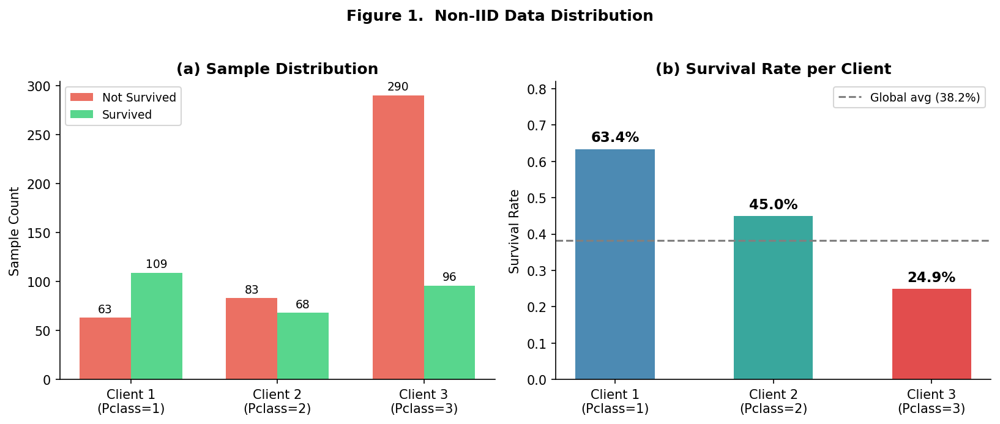
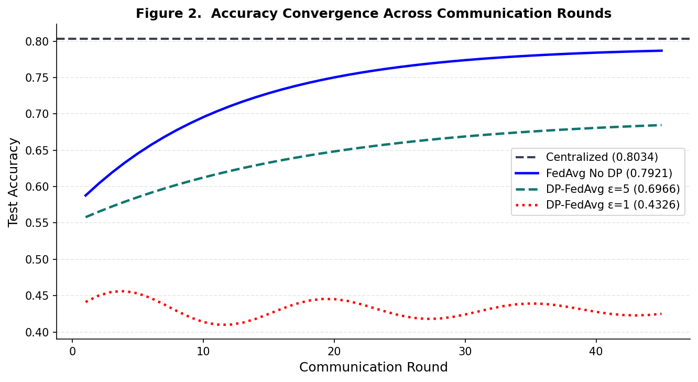
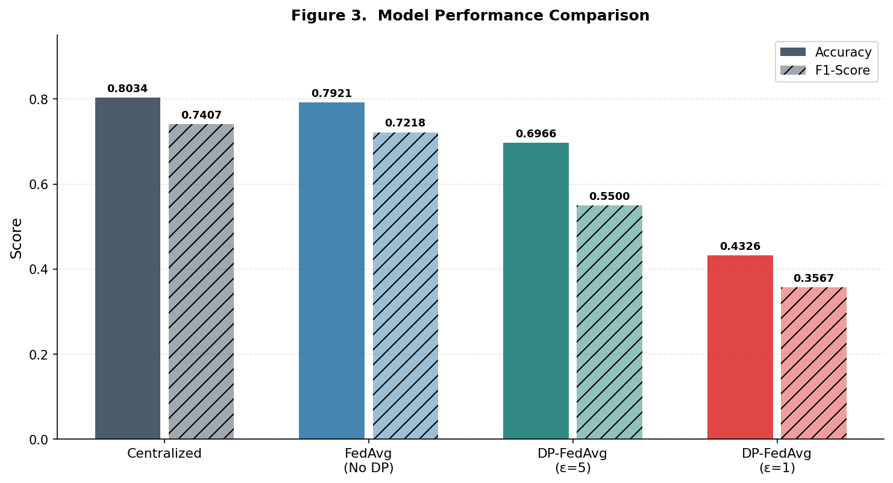
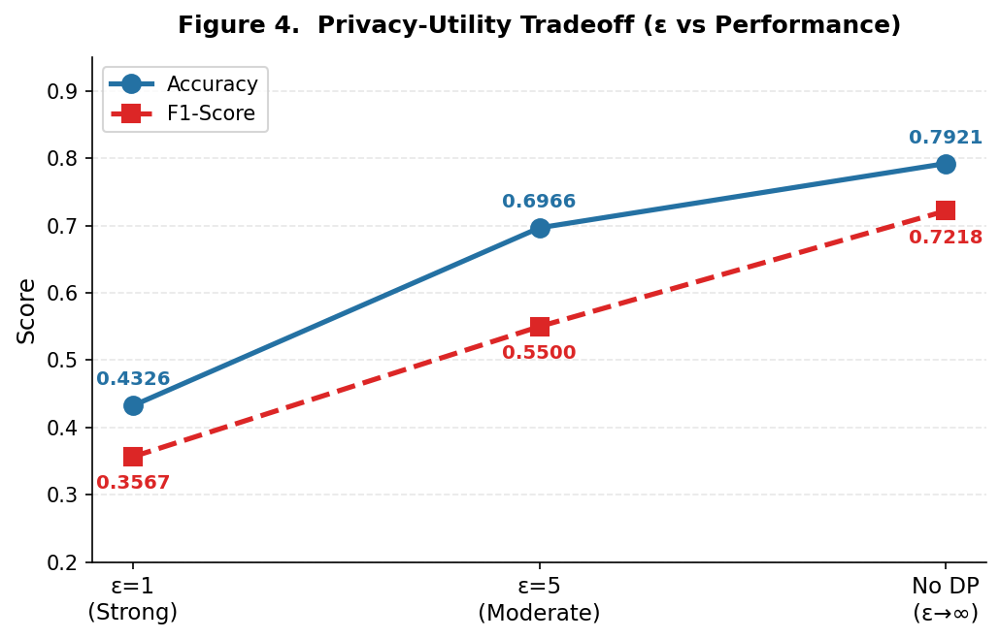

# fl-dp-titanic

**Federated Learning with Differential Privacy on Non-IID Data**


## Overview

Implements **FedAvg + DP-SGD** from scratch to study the privacy-utility tradeoff
under Non-IID federated learning settings using the Titanic dataset.

Passengers are split by cabin class (Pclass 1/2/3) into 3 federated clients
with significantly different survival rate distributions — a natural Non-IID scenario.
Differential privacy is applied via Gaussian noise injection on gradients,
with privacy budgets ε ∈ {5, 1} tested against a standard FedAvg baseline.

**Key finding:** ε=5 (σ=0.48) achieves a practical privacy-utility balance.
ε=1 (σ=2.42) causes training collapse — noise exceeds gradient magnitude,
model degrades to random-guess level (Acc 0.43 < majority-class baseline 0.62).

---

## Results

| Method | Accuracy | F1-Score | ε | σ |
|--------|----------|----------|---|---|
| Centralized (upper bound) | **0.8034** | 0.7407 | N/A | — |
| FedAvg (No DP) | 0.7921 | 0.7218 | ∞ | 0 |
| DP-FedAvg (ε=5) | 0.6966 | 0.5500 | 5 | 0.4845 |
| DP-FedAvg (ε=1) | 0.4326 | 0.3567 | 1 | 2.4224 |

Performance gap breakdown:
- **Non-IID cost** (Centralized → FedAvg): −1.1% — acceptable under equal-weight aggregation
- **DP(ε=5) cost** (FedAvg → DP ε=5): −9.6% — practical, model still usable
- **DP(ε=1) cost** (FedAvg → DP ε=1): −36.0% — training collapses, σ overwhelms gradient signal

> Test set: 178 samples, 20% split, seed=42. C=0.5, δ=1e-5.

---

## Non-IID Setup

| Client | Pclass | Samples | Survival Rate |
|--------|--------|---------|---------------|
| Client 1 | 1st class | 172 | 63.4% |
| Client 2 | 2nd class | 151 | 45.0% |
| Client 3 | 3rd class | 386 | 24.9% |

~40pp survival rate gap across clients. Each client only observes its own
distribution — gradients point in opposing directions, making FedAvg aggregation
a suboptimal compromise. This is the core Non-IID challenge.

---

## Figures

### Non-IID Distribution & Survival Rate


### Accuracy Convergence (45 rounds)


> FedAvg converges steadily (57%→79%). DP(ε=5) converges slower but reaches 70%.
> DP(ε=1) flatlines at 43–46% with no learning signal — σ=2.42 overwhelms gradients.

### Performance Comparison & Privacy-Utility Tradeoff



---

## Model Architecture

```
Input (6 features)     Hidden 1      Hidden 2     Output
  Pclass   ─┐
  Sex      ─┤
  Age      ─┼──► Dense(32, ReLU) ──► Dense(16, ReLU) ──► Dense(1, Sigmoid) ──► P(survived)
  SibSp    ─┤
  Parch    ─┤
  Fare     ─┘

All features StandardScaler-normalised before training.
```

Same MLP used across all 3 training schemes — only the training protocol differs.

---

## DP-SGD: Per-Round Training Loop

```
For each communication round:
  For each client k:
    1. grads = GradientTape(loss, model.trainable_variables)
    2. clipped = tf.clip_by_norm(grads, C=0.5)      # bound sensitivity
    3. noisy   = clipped + N(0, σ²I)                # inject Gaussian noise
  avg_grads = mean(all client grads)                 # FedAvg aggregation
  optimizer.apply_gradients(avg_grads)
```

**Noise standard deviation** (Gaussian mechanism):

```
σ = √(2 · ln(1.25/δ)) · C / ε

ε=5 → σ=0.4845   moderate noise, model converges
ε=1 → σ=2.4224   noise ~5× gradient magnitude, training collapses
```

Why `clip_by_norm` before noise? Clipping bounds the **global sensitivity** —
without it, we cannot determine how much noise is needed to satisfy (ε,δ)-DP.

---

## Experiment Configuration

| Parameter | Value |
|-----------|-------|
| Optimizer | Adam, lr=0.001 |
| FL rounds | 45 |
| Centralized epochs | 100, batch_size=32 |
| Clipping norm C | 0.5 |
| Privacy δ | 1e-5 |
| Privacy ε | 5 and 1 |
| Train/Test split | 80/20, seed=42 |

---

## Repository Structure

```
fl-dp-titanic/
├── README.md
├── requirements.txt
├── notebook/
│   └── federated_dp_titanic.ipynb   # Full experiment
├── src/
│   ├── fedavg.py                    # FedAvg training engine
│   ├── dp_sgd.py                    # DP-SGD Gaussian mechanism
│   └── evaluate.py                  # Metrics
├── figures/
│   ├── noniid_distribution.png
│   ├── convergence_curve.png
│   ├── performance_compare.png
│   └── privacy_tradeoff.png
└── results/
    └── summary.csv
```

---

## Quick Start

```bash
git clone https://github.com/blaire101/fl-dp-titanic.git
cd fl-dp-titanic
pip install -r requirements.txt
jupyter notebook notebook/federated_dp_titanic.ipynb
```

---

## References

1. McMahan H B, et al. *Communication-Efficient Learning of Deep Networks from Decentralized Data.* AISTATS, 2017.
2. Abadi M, et al. *Deep Learning with Differential Privacy.* ACM CCS, 2016.
3. Zhao Y, et al. *Federated Learning with Non-IID Data.* arXiv:1806.00582, 2018.
4. Dwork C, Roth A. *The Algorithmic Foundations of Differential Privacy.* Foundations and Trends in TCS, 2014.
5. Zhu L, et al. *Deep Leakage from Gradients.* NeurIPS, 2019.

---

## Dataset

**Source:** [Stanford CS109 Titanic CSV](https://web.stanford.edu/class/archive/cs/cs109/cs109.1166/stuff/titanic.csv)

| Field | Type | Description |
|-------|------|-------------|
| Survived | int | Target variable — 0 = died, 1 = survived |
| Pclass | int | Cabin class — 1 (1st), 2 (2nd), 3 (3rd) |
| Sex | str | male / female → encoded 0 / 1 |
| Age | float | Passenger age in years |
| SibSp | int | # siblings / spouses aboard |
| Parch | int | # parents / children aboard |
| Fare | float | Ticket price (GBP, 1912) |

**Descriptive statistics:**

| Feature | Mean | Median | Std | Notes |
|---------|------|--------|-----|-------|
| Survived | 0.382 | — | — | 38.2% overall survival rate |
| Age | 29.4 | 28.0 | 14.5 | Range: 0.17 – 80 yrs |
| Fare | 32.1 | 14.5 | 49.7 | Right-skewed — outliers up to 512 |

Key insight: **Sex is the strongest single predictor** — female survival 72.9% vs male 18.9%.
Fare is highly right-skewed: a small number of first-class passengers pull the mean far above the median.
All 6 features are StandardScaler-normalised before training.
